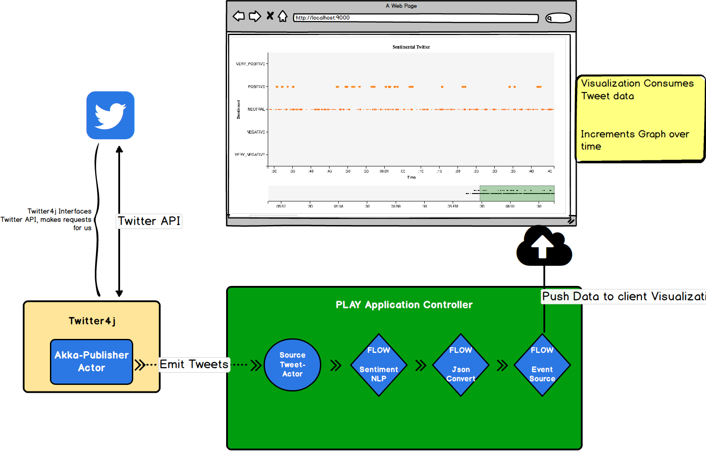
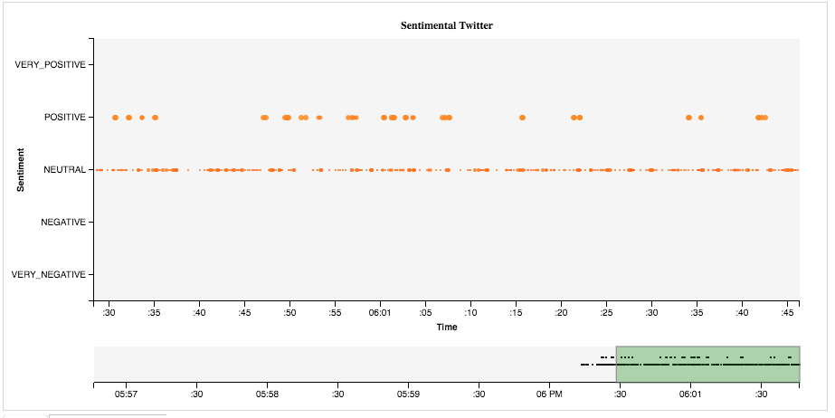

# CS 474: Final Project

### Authors
+ Kyle Almryde*
+ Mike McClory
+ Abhishek Tripanthi

#### Preamble

This README documents the installation and usage for the cs474 Final Project tasked with developing a streaming pipeline application.

### What is this repository for? ###

Using the [Scala language](http://www.scala-lang.org/), [Akka](https://akka.io), [Play Framework](https://www.playframework.com/),
[Twitter4j](https://github.com/yusuke/twitter4j), [Stanford CoreNLP](http://corenlp.org), and [D3](https://d3js.org/), this application streams randomly sampled Twitter data through a Natural Language Processing Sentiment Classifier and displays the results on a web browser based visualization.

### Languages and Libraries
* [Scala language](http://www.scala-lang.org/) was used on the server side
* [Ecma Script](http://www.javascript.org), more colloquially know as Javascript was used on the client side web browser
* [Akka](https://akka.io) was used for the Actor system and data Streaming
* [Play Framework](https://www.playframework.com/) was used for the web server which passed the streamed data to a web client
* [Stanford CoreNLP](http://corenlp.org) for the NLP processing utilities and sentiment models
* [twitter4j](https://github.com/yusuke/twitter4j) was used to interface with the Twitter API for streaming Tweets
* [D3](https://d3js.org/) Is a Javascript library that was utilized for developing the data visualization of the oncoming stream as well as general html manipulations.
* [Real Time Chart Multi](https://bl.ocks.org/boeric/6a83de20f780b42fadb9) Is a D3 based Javascript library which handled the chart construction.

### How do I get set up?

You have two options with regards to setting up the application. The first is to use a light weight text editor to peruse the project (Sublime Text 3 for the win!!). If this were one of a 50+ projects you needed to grade, I would go this route *hint hint*

To run the application, navigate to the root level of the project and run ```sbt run``` task, ie:
```
cd kyle_mike_abhishek_finalproject/
sbt run
```
Give it a minute to download and compile the libraries then a web browser will open. If not, open your browser and point it at http://localhost:9000/ or just [click here](http://localhost:9000/)

**NOTE** It is imperitive that the user be aware of Twitter's API rate limit. What this largely means is restarting the application in close successions will often result in a block being placed on the stream. If you dont see any kind of activity, check to make sure the console isnt emitting such a warning. If it is, stop the application, go grab your favorite beverage of choice (beer), and it should be good to go.

####Setting up from IntelliJ ####

1) If no project is currently open in IntelliJ IDEA, click **Import Project** on the Welcome screen. Otherwise, select **File | New | Project from Existing Sources**.

2) In the dialog that opens, select the directory that contains the project to be imported, or a file that contains an appropriate project description. Click **OK**.

3) On the first page of the **Import Project** wizard, select SBT, and click **Next**. (This page is not shown if IntelliJ IDEA has guessed what you are importing.)

4) On the next page of the wizard, specify SBT project settings and global SBT settings, click **Finish**.

####Full Disclosure
If you have a poor Internet connection, you are going to have a bad time. Dont let ComCast get you down! (But seriously, Fuck you comcast)
Joking aside, this app requires a solid Internet connection in order to do its job. The app may not shutdown in some cases...

Another note, Please give it some time.

#### Unit Testing
For Unit-testing I utilized Akka's Actor Testkit[ScalaTest](http://www.scalatest.orge) using the [FunSuite](http://doc.scalatest.org/3.0.0/#org.scalatest.FunSuite). Its fun and was surprisingly simple to get it up and running. The Akka Testkit was no walk in the park though, so forgive the stupid simple tests.

Go figure.

To run the tests, in Intellij simply select the **SBT** task "Test" and youll be up and running! Que sera


## Discussion:
This project turned out to be particularly challenging in a large part due to the way Twitter4j handles the data streams.

The Listener/Callback model for handling incoming streams from Twitter, while its great for your typical java application, it gets a little tricky to incorporate it into a Reactive Streaming model like Akka incorporates.

Below is a detailed description of each step in the streaming model pipeline and a discussion about the overall OOP and Functional structure of the code and general implementation details.



##### Generating a Source
To get around this, I utilized a hybrid actor/stream model wherein I create a specially designed Actor to act as a
'Publisher Source'. What this means is the actor sits inside of the Callback function and emits the incoming tweets as they arrive. The advantage of this approach is it let me process those tweets in whatever way I wanted to right away. From that point the pipeline is pretty standard Akka streaming approach.

Listener/Callback Model which, while great in the conventional sense, proves tricky once you start trying to integrate it into a reactive model something like Akka's streaming library.

##### Flow: Sentiment Analysis
A basic Flow pipeline is constructed wherein the first step, sentiment classification, is performed on the tweets. I ended up going with the Stanford CoreNLP framework as it is a robust library built for Machine Learning experts by Machine Learning experts. Beyond the initial startup time, it is quite robust and fast, easily able to handle the rapid fire data stream. Classification used a 5-point rating system, VERY\_NEGATIVE, NEGATIVE, NEUTRAL, POSITIVE, VERY\_POSITIVE). The biggest limitation came from the sentiment model used to classify the tweets themselves. Namely, there was a strong bias (at least towards the random sample stream) for **NEUTRAL** labeled tweets. The issue was that the Sentiment Model was trained on classically labeled corpora (such as IMDB Movie reviews) rather than tweets explicitly.

The appropriate fix for this step would have been to retrain the model using labeled twitter data, which is fine and good except all published corpora require you to harvest the tweets yourself (they provide the tweet IDs), which for a decently sized training dataset could take upwards of 18hrs (Due to Twitters data mining policies). Thus (with a heavy heart) for this project I chose to skip this step as it was outside the scope of this project. However, for a future extension, it could be interesting!

##### Flow: Json conversion and Eventsource
The last two steps involved were intrinsically tied with one another. Once I had the Tweets classified, they were passed to a Json conversion node wherein the case class wrappers were implicitly converted to Json Value types. This was necessary for the next node which directs the stream into an EventSource Flow which routes the results to the Web Client.


##### Integrating with Play
All of the above steps are performed inside of a Play Framework Controller context. Thanks to the wonderful folks at [Typesafe](http://typesafe.org) for seamlessly integrating Akka within Play, nearly all of these steps work out of the box with little configurations. That being said, what the Play Framework wants and what Akka wants can often come into conflict. It would have also helped if I had a proper background in networking as in the end making everything play nice together was the most challenging part of the entire project. Once data has reached the JSON node in the Flow Graph, tweets are routed to the web client where they are consumed by the visualization system.

**Side Node**: I am at once immensely proud that I was able to get this step working at all and more than a little frustrated with just how complicated the entire procedure was. The amount of code is deceptively small, but the mental hurdles that were required to overcome were immense!

##### Towards the Data Visualization
The data visualization was built using D3, an incredible javascript web library very well suited to data vis on the web. Handling the incoming data stream as a result was quite easy. The motivation behind the visualization, which in my opinion was very successful was to show a real-time update of the sentiments as they came in. From a performance perspective there was a real concern that the volume of the data stream could overwhelm the visualization system and have serious performance impacts on the browser. The good news is that there are available solutions in place which can mitigate this, namely the use of the performant but less user-friendly Canvas over the more 'friendlier' but less performant SVG. Based on a large part to Twitter4j's "garden hose" streaming model, load tests and performance measures showed the application maintaining an acceptable frame rate even after 15mins of constant data streaming while using SVG. Performance does drop over time, but for the basic system (of which this is an early prototype) it works.

Future developments will focus on adapting the current visualization system to using a Canvas based approach, as well as adding more interaction around the tweets themselves. For instance, allowing a user to select and view an individual tweet to see its contents etc.



#### Object Oriented and Functional Design Principles
Where I could, I made a strong effort to engage in good and strong Function Programming Principles.

##### Limitations
Despite the many triumphs, this project is not perfect (are they ever?). As I discussed above, it was immensely challenging getting the twitter API to properly communicate with the Akka Streaming model and THEN routing that data into the browser.

+ **Dynamic Querying**: Unfortunately I was unable to get the querying to work on a dynamic scale. That is to say, the application streams in a random Sample of the twitter stream, which is admittedly a lot of data, but it would have been more interesting if we could modify the kind of tweets that come in based on User input. This is entirely due to my lack of understanding towards client to server communications and the way in which the Play Framework handles these kinds of tasks.

+ **Sentiment Analysis**: As outlined above, the sentiment model is trained on traditional sentence based corpora rather than one based on twitter data explicitly. As such, you are likely to see a higher than normal (or accurate!) amount of Neutral rated tweets.

##### Known Bugs
In an effort to be fully transparent, there is an known bug in which, for reasons I have yet to discover, seems to generate two instances of the application. As such, you will likely encounter two browsers being opened and duplicate tweets streaming in. The positive to this is that from a performance perspective, the application holds up quite well. For my own learning's sake (and pride) I intend to figure out how and why. In the meantime, accept my most humblest of apologies.


### Who do I talk to? ###

* If you have any specific questions contact me via [kyle.almryde@gmail.com](mailto:kyle.almryde@gmail.com)
* If you have any complaints, please direct them to this [Handsome devil](mailto:drmark@uic.edu)


